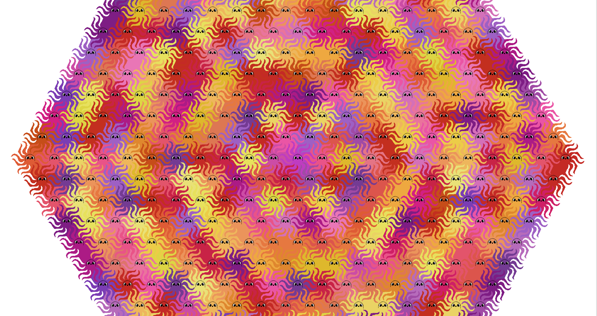
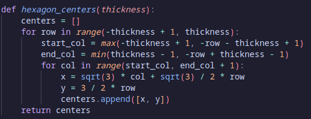
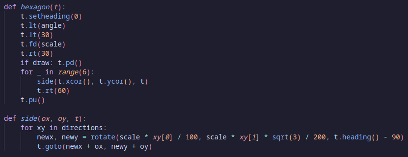
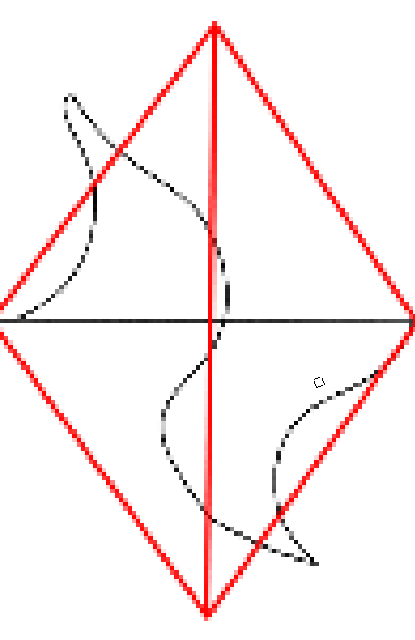
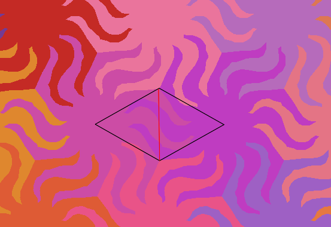

# Octopus-Tessellation

## Credit
All code in this repository is written by me. No outside sources were used beside for general mathematical review.
I made use of standard python libraries and the 2D drawing environment supplied by the turtle module.

## How to Run
Download the compressed executable from releases.
Extract this zip file and navigate to tessellation/dist/tessellation. 
From there, the executable may be run.

If you are using Windows, you will need to use to use a python IDE (such as Thonny) or run the program through the console using the command "python tessellation.py" on the file after cloning the repository. I am unfortunately not able to access a Windows computer and cannot compile to Windows or know if the .exe works. 

If you are running the program through the terminal, you will need to install tk (for tkinter module).

## Project Description
This program uses turtles to draw a tiling of an octopus shape that can perfectly cover a 2D plane.

## Code Overview
This is a project that is relatively simple in complexity but incorporates several techniques in drawing the figures.

The generated tiling uses regular hexagons, which naturally tiles the plane, as a base. The program requires a finite radius of hexagons from a center to be rendered, so a width variable is passed to the function. From there, this function returns coordinates of the centers of all hexagons.

Afterward, a loop is run over all these coordinates to draw altered hexagons. The turtle is first moved to the edge of a vertex before running the function to draw a single side. This is then repeated 6 times.

For the side() function, the turtle moves according to a set of hard-coded coordinates that are mapped according to its current position and rotation. These coordinates were obtained from coordinates that I saved from a drawing of the desired shape in a image editor. As the image editor saved coordinate in integers, I needed to rescale from the height and width of the canvas.

One can create a new tiling shape from a symmetrical tiling shape like the hexagon by using symmetry and reflections to remove an area from a portion of the shape then shift it somewhere else. 

Below is an image modeling what boundaries defined the shapes I was allowed to create using this. The tentacle on the left is an protrusion of a shape into a neighboring hexagon. While the the tentacle on the right is an intrusion of the neighboring hexagon back into the shape.

The tentacles should be congruent and symmetrical about the point in the center (intersection of the black and red lines) so that all "negative space" could be filled by an equivalent "positive space."

Additionally, as each side "owns" a sixth of the hexagon, defined by the sector containing one of the 6 equilateral triangles in a hexagon, it is generally best not to have the shapes exit those triangles. If a portion of the shape exits the sector it belongs in, then the final shape has risk of clipping into other sides.

In the below image, the red line indicates the original edge shared by the two shapes. If you look closely, the tentacles originating from the red line clip out of their own portion of the hexagon, but they luckily do not cause the shape clip over itself. 

Finally, I added randomized colors to be radiating certain distances from the center. Additionally, I added on an option to add a face to each octopus by setting the variable "want_face" to 1. Strangely, this appears to be the one of the more computationally expensive and longest functions there. This is likely due to the hard-coding of the instructions to create the face. 

